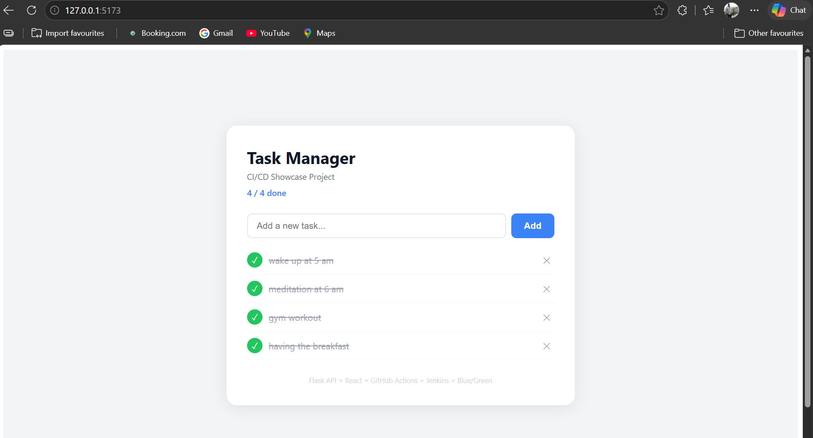
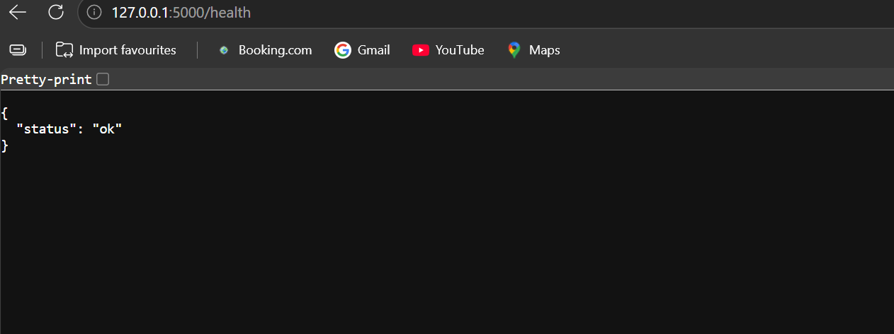
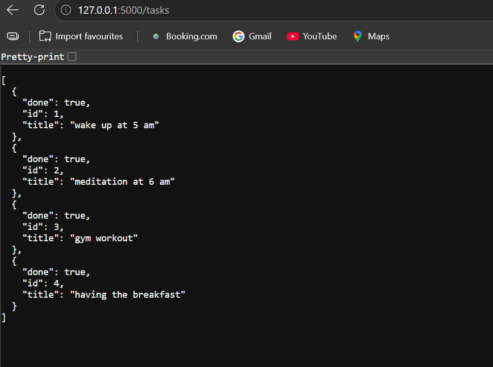
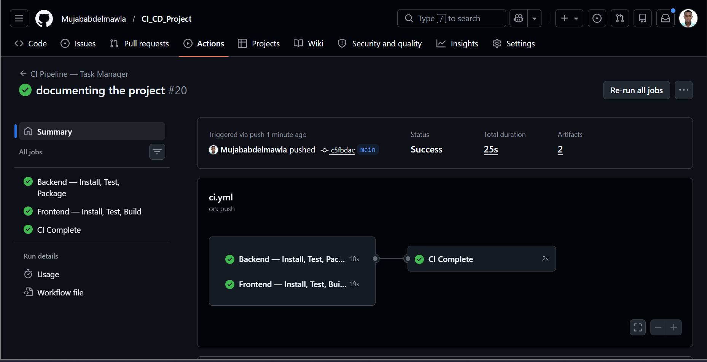
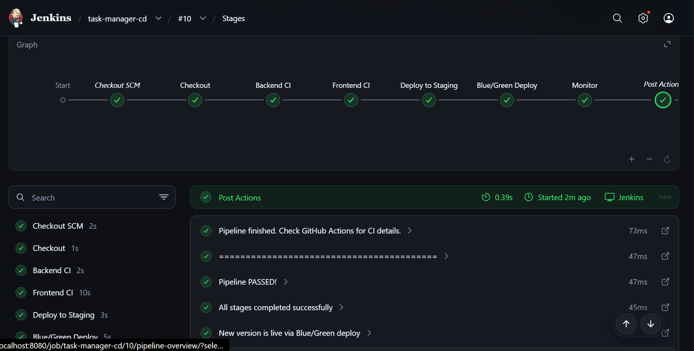
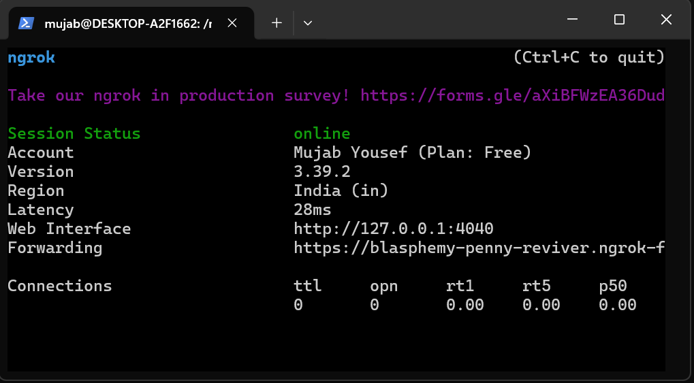
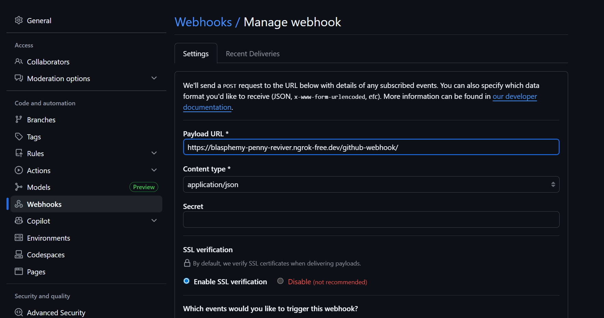
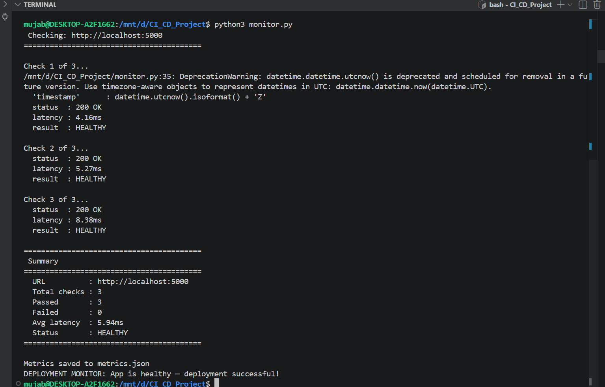
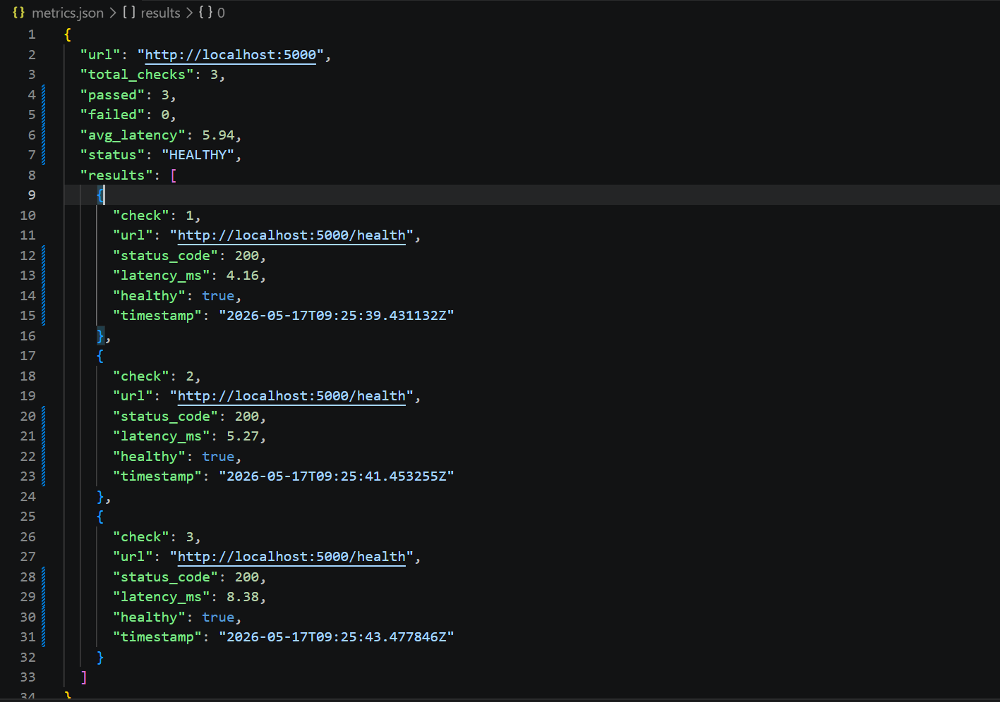

# Task Manager — CI/CD Showcase Project

> A full-stack task manager application built to demonstrate a complete CI/CD pipeline from code push to live deployment — using GitHub Actions, Jenkins, and Blue/Green deployment strategy.

---

## Table of Contents

- [What This Project Is](#what-this-project-is)
- [Tech Stack](#tech-stack)
- [Project Structure](#project-structure)
- [The Application](#the-application)
- [How to Run Locally](#how-to-run-locally)
- [Running the Tests](#running-the-tests)
- [CI Pipeline — GitHub Actions](#ci-pipeline--github-actions)
- [CD Pipeline — Jenkins](#cd-pipeline--jenkins)
- [Blue/Green Deployment](#bluegreen-deployment)
- [Post-Deployment Monitoring](#post-deployment-monitoring)
- [Webhook Setup](#webhook-setup)
- [Complete Flow](#complete-flow)
- [Screenshots](#screenshots)

---

## What This Project Is

This project showcases every concept in a real CI/CD pipeline:

| Concept | Implementation |
|---|---|
| Continuous Integration | GitHub Actions — auto build and test on every push |
| Continuous Deployment | Jenkins — auto deploy after CI passes |
| Unit Testing | pytest (12 tests) + Vitest (7 tests) |
| AAA Pattern | Every test follows Arrange → Act → Assert |
| Artifacts | Built outputs uploaded and stored after every run |
| Webhooks | GitHub notifies Jenkins automatically on every push |
| Staging | Health checked environment before production |
| Blue/Green Deployment | Zero downtime deployment with instant rollback |
| Post-Deploy Monitoring | monitor.py verifies app health after every deployment |

---

## Tech Stack

| Layer | Technology |
|---|---|
| Backend | Python, Flask, Flask-CORS |
| Frontend | React, Vite |
| Backend Tests | pytest, pytest-cov |
| Frontend Tests | Vitest, Testing Library |
| CI Platform | GitHub Actions |
| CD Platform | Jenkins |
| Deployment Strategy | Blue/Green |
| Monitoring | monitor.py + metrics.json |
| Local Tunnel | ngrok |

---

## Project Structure

```
cicd-project/
│
├── .github/
│   └── workflows/
│       └── ci.yml              # GitHub Actions CI pipeline
│
├── backend/
│   ├── app.py                  # Flask REST API
│   ├── test_app.py             # 12 unit tests
│   └── requirements.txt        # Python dependencies
│
├── frontend/
│   ├── src/
│   │   ├── App.jsx             # Main React component
│   │   ├── App.test.jsx        # 7 unit tests
│   │   ├── main.jsx            # React entry point
│   │   └── setupTests.js       # Vitest configuration
│   ├── index.html
│   ├── package.json
│   └── vite.config.js
│
├── screenshots/                # Project screenshots
├── .gitignore
├── Jenkinsfile                 # Jenkins CD pipeline
├── monitor.py                  # Post-deployment health checker
└── README.md
```

---

## The Application

A task manager where you can add, complete, and delete tasks.

### Flask API Endpoints

| Method | Endpoint | Description | Response |
|---|---|---|---|
| GET | `/health` | Health check | `{"status": "ok"}` |
| GET | `/tasks` | Get all tasks | List of tasks |
| POST | `/tasks` | Add a new task | Created task |
| DELETE | `/tasks/<id>` | Delete a task | Success message |
| PATCH | `/tasks/<id>/done` | Toggle done/undone | Updated task |

### How Frontend and Backend Connect

```
React (port 5173)
      ↓
User clicks Add
      ↓
POST /tasks → Vite proxy → Flask (port 5000)
      ↓
Flask creates task → returns JSON
      ↓
React updates UI
```

The proxy in `vite.config.js` forwards all `/tasks` and `/health`
requests from React to Flask during development.

---

## How to Run Locally

### Requirements
- Python 3.10+
- Node.js 18+

### Terminal 1 — Flask Backend
```bash
cd backend
python3 -m venv venv
source venv/bin/activate
pip install -r requirements.txt
python app.py
# Running at http://localhost:5000
```

### Terminal 2 — React Frontend
```bash
cd frontend
npm install
npm run dev
# Running at http://localhost:5173
```

Open `http://localhost:5173` in your browser.

> Flask must be running before opening the React app,
> otherwise it shows "Could not connect to backend."

---

## Running the Tests

### Backend — 12 Tests
```bash
cd backend
source venv/bin/activate
pytest -v --cov=app --cov-report=term-missing
```

**What is tested:**
- Health endpoint returns 200
- GET tasks returns empty list and all tasks
- POST task creates correctly with auto-increment ID
- POST task with missing or empty title returns 400
- DELETE task removes it and returns 200
- DELETE non-existent task returns 404
- PATCH toggles task done and back to undone
- PATCH non-existent task returns 404

### Frontend — 7 Tests
```bash
cd frontend
npm test
```

**What is tested:**
- App renders the title
- Shows empty state when no tasks
- Renders tasks fetched from API
- Adds task when Add button clicked
- Shows error for empty task input
- Removes task when delete clicked
- Toggles task to done when check clicked

> All tests follow the AAA pattern:
> Arrange (set up data) → Act (run the function) → Assert (check result)

---

## CI Pipeline — GitHub Actions

**File:** `.github/workflows/ci.yml`
**Trigger:** Every push or pull request to `main`
**Runs on:** GitHub's Ubuntu cloud runners

### Pipeline Jobs

```
Job 1: backend-ci
         ↓
Job 2: frontend-ci    (needs: backend-ci)
         ↓
Job 3: ci-success     (needs: backend-ci + frontend-ci)
```

The `needs` keyword controls order — if backend-ci fails,
frontend-ci never starts. Nothing runs unless the previous job passed.

### Job 1 — backend-ci
```
→ Checkout code
→ Setup Python 3.10
→ pip install -r requirements.txt
→ pytest -v --cov=app --cov-report=term-missing
→ Upload backend artifact
```

### Job 2 — frontend-ci
```
→ Checkout code
→ Setup Node 18
→ npm install
→ npm test
→ npm run build
→ Upload frontend artifact (dist/)
```

### Job 3 — ci-success
```
→ Prints success confirmation
→ Only runs if BOTH jobs passed
```

**Total CI time: ~26 seconds**

---

## CD Pipeline — Jenkins

**File:** `Jenkinsfile` (project root)
**Trigger:** GitHub webhook on every push
**Language:** Groovy (Declarative Pipeline)

### Pipeline Stages

```
Stage 1: Checkout
Stage 2: Backend CI
Stage 3: Frontend CI
Stage 4: Deploy to Staging
Stage 5: Blue/Green Deploy
Stage 6: Monitor
```

If any stage fails — the pipeline stops immediately.
Nothing after it runs. The old version stays live.

### Stage 1 — Checkout
```groovy
checkout scm
```
Clones the latest code from GitHub into the Jenkins agent.

### Stage 2 — Backend CI
```bash
python3 -m venv myvenv
. myvenv/bin/activate
pip install -r requirements.txt
pytest -v --cov=app --cov-report=term-missing
```

### Stage 3 — Frontend CI
```bash
npm install
npm test
npm run build
```

### Stage 4 — Deploy to Staging
```bash
pkill -f "python app.py" || true
nohup python app.py > /tmp/staging.log 2>&1 &
sleep 3
curl -f http://localhost:5000/health || exit 1
```
If health check fails — pipeline stops. Nothing reaches production.

### Stage 5 — Blue/Green Deploy
```
Check active environment (blue or green)
Deploy new version to inactive environment
Health check new environment
Switch traffic if healthy
Old environment stays as instant rollback
```

### Stage 6 — Monitor
```bash
python monitor.py
```
Runs 3 health checks. Saves metrics.json.
exit(0) = success. exit(1) = pipeline fails.

### Post Block
```
success → Pipeline PASSED — new version is live
failure → Pipeline FAILED — old environment stays live
always  → Pipeline finished
```

**Total CD time: ~48 seconds**

---

## Blue/Green Deployment

### The Concept

Two identical environments always running.
Only one serves real users at a time.

```
BLUE  → port 5001 → current live version (v1)
GREEN → port 5002 → new version being deployed (v2)
```

### Deployment Flow

```
Step 1: New version deploys to GREEN (inactive)
              ↓
Step 2: Health check runs on GREEN
              ↓
Step 3: Health check passes
              ↓
Step 4: Traffic switches from BLUE to GREEN
              ↓
Step 5: BLUE stays running as instant rollback
```

### If Health Check Fails

```
New version deploys to GREEN
              ↓
Health check FAILS
              ↓
Pipeline stops — traffic never switches
              ↓
BLUE keeps serving users — zero downtime
```

---

## Post-Deployment Monitoring

**File:** `monitor.py`

Runs automatically after every deployment as Stage 6 in Jenkins.

### What It Does

```
Run 3 health checks with 2 second gaps
          ↓
Each check: GET /health → record status + latency
          ↓
Calculate: passed, failed, average latency
          ↓
Save results to metrics.json
          ↓
exit(0) all healthy  → Jenkins GREEN
exit(1) any failed   → Jenkins RED
```

### Sample metrics.json Output

```json
{
  "url": "http://localhost:5000",
  "total_checks": 3,
  "passed": 3,
  "failed": 0,
  "avg_latency": 45.23,
  "status": "HEALTHY"
}
```

---

## Webhook Setup

Jenkins runs locally so ngrok exposes it to GitHub.

### Why ngrok?

```
GitHub needs a public URL to send webhook to
Jenkins is on localhost — no public URL
ngrok creates a tunnel:

GitHub → https://your-url.ngrok-free.dev → localhost:8080 → Jenkins
```

### Setup Steps

```bash
# 1 — Start ngrok
ngrok http 8080

# 2 — Copy the forwarding URL

# 3 — Add webhook in GitHub:
# Repo → Settings → Webhooks → Add webhook
# Payload URL : https://your-url.ngrok-free.dev/github-webhook/
# Content type: application/json
# Event       : Just the push event
```

> In production Jenkins runs on a cloud server with a real
> public IP — ngrok is not needed.

---

## Complete Flow

```
Developer pushes code to GitHub
              ↓
GitHub Actions triggers automatically      ~26 seconds
  ✓ 12 Flask tests passed
  ✓ 7 React tests passed
  ✓ React app built into dist/
  ✓ Artifacts uploaded
              ↓
GitHub webhook fires → ngrok → Jenkins triggers
              ↓
Jenkins pipeline runs                      ~48 seconds
  ✓ Code checked out from GitHub
  ✓ Backend installed and tested
  ✓ Frontend installed, tested, built
  ✓ Staged and health checked
  ✓ New version deployed to green
  ✓ Traffic switched to green
  ✓ monitor.py ran 3 health checks
  ✓ metrics.json saved
              ↓
Total: ~74 seconds from push to live ✅
```

---

## Screenshots

### React App — Running on port 5173


### Flask API — Health Endpoint


### Flask API — Tasks with Completed Status


### GitHub Actions — Full CI Pipeline Green


### Jenkins — Full CD Pipeline Output


### ngrok — Payload Link


### GitHub Webhook — ngrok Link Connected


### monitor.py — Monitoring Output


### metrics.json — Output After Deployment


---

## Author

**Mujab Yousef** — DevOps And Cloud Engineer In Training 